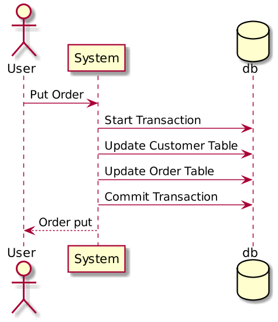
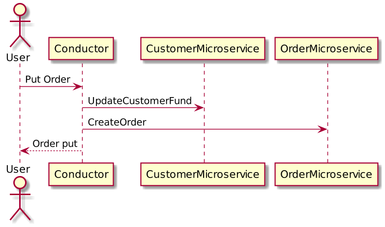
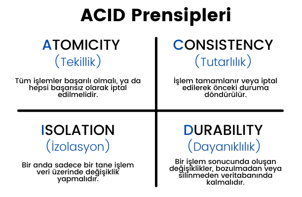
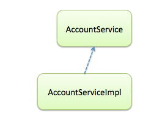
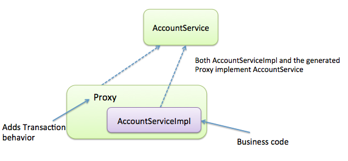

# Transaction Management

---

## Transaction Nedir ? 

Transaction, beraberce başarılı veya başarısız olan olaylar serisidir.
Yapılan işlemlerin her birinin başarılı olması durumunda commit edilmesi herhangi birinin başarısız olması 
ise işlemlerin tamamının başarısız olarak kabul edilerek rollback yapması olayıdır. Bu işlem bize veri bütünlüğünü sağlar.

## Transaction Türleri

Transactionlar kullanım yerlerine göre global ve local olarak ikiye ayrılır.




Yukarıdaki sipariş örneğinde gösterildiği gibi, kullanıcı monolitik bir sisteme Order isteği gönderdiği zaman, alakalı transactionlar ortak bir veritabanına yazılır.
Hata durumunda ise tek bir yapı halinde rollback edilebilir.



Sistem Monolit yapıdan Mikroservis mimarisine geçirildiğinde, Customer ve Order işlemleri için iki farklı servis oluşturulur ve alakalı veritabanlarıda ayrılmış olur. 
Bu durumda iki servis için gerekli olan transactionların ayrı olarak yönetilmesi gerekir. Transaction artık birden çok veritabanında olduğundan, **Distributed Transaction** olarak kabul edilir.

## Transaction Özellikleri
Transaction yönetiminde aşağıdaki konular göz önünde bulundurulmalıdır;

- Failure recovery (Atomicity, Durability).
- Concurrency control (Isolation, Consistency).

ACID prensiplerinın uygulanması sağlıklı bir transaction gerçekleştirmemizi sağlar.

### Automicity

Transaction işlemini bir bütün olarak görür. İşlem sırasında birden fazla veritabanı/tablodaki verinin güncellenmesi gerçekleşiyor 
ise tüm bunların hepsi birden başarılı olacaktır veya başarısız olacaktır

### Consistency

Gerçekleştirilen Transaction işleminden etkilenen verilerin başlangıç ve bitiş durumlarının tutarlı olması gereklidir. Transaction sırasında oluşan bir hatanın, sistemin durumunu beklenmeyen bir şekilde etkilemesi engellenir.

### Isolation

Aynı anda aynı veri üzerinde birden fazla Transaction gerçekleşebilir. Transaction’ların birbirlerinin işlemlerinden etkilenmemesi için işlemlerin Seri olarak yapılması gerekir. Transaction sırasında ilgili ve etkilenecek veri, işlem başarılı veya başarısız olarak sonuçlanana kadar veri setleri kilitlenir.

### Durability

Transaction sırasında fiziksel veya işlemsel bir hata olması durumunda sistemin kendisini bir önceki geçerli veri durumuna döndürebilme kabiliyetidir.



---

## Transaction Yönetimi Nedir?

Kullanılan transactionların ne gibi kurallar dahilinde çalışacağı kontrol edilebilir.

## Spring Proxy Kullanımı

Spring, Transactional anotasyonu kullanılmış sınıf veya metodlar için direk çağrı yerine, bir proxy kullanır. Bu transaction mantığı ile iş mantığını birbirinden
ayırma konusunda yardım eder.

Örneğin aşağıdaki gibi bir yapıya sahip olalım.



AccountService sınıfı için bir çağrı yapıldığında;



Burada araya bir proxy yapısı girer ve gerekli sınıfa veya metoda bu yapı üzerinden ulaşırız.


## Transaction Yönetim Türleri


Spring transaction yönetimi için iki yöntem sunar. Programatik ve Deklaratif

### Programmatic

Transaction yönetimi(commit, rollback) kodlarının içinde barındıran bir yöntemdir.

```
@Override
public void transferMoney(Account from, Account to, double amount, double fee) {
	TransactionDefinition transactionDefinition = new DefaultTransactionDefinition();
	TransactionStatus transactionStatus = transactionManager.getTransaction(transactionDefinition);
	try {
		withdraw(from, amount, fee);
		deposit(to, amount);
		transactionManager.commit(transactionStatus);
	} catch (RuntimeException e) {
		transactionManager.rollback(transactionStatus);
		throw e;
	}
}

```

### Declarative

Spring altyapısında bazı kurallar çerçevesinde Spring Container tarafından gerçekleştirilir.

- @Transactional Anotasyonu sayesinde yapılır

```
@Override
@Transactional
public void transferMoney(Account from, Account to, double amount, double fee){
	withdraw(from, amount, fee);
	deposit(to, amount);
}
```
Bu transaction yönetimi şeklinde sahip olduğumuz bazı işlem tipleri vardır.


- Propagation tipi
- Isolation seviyesi
- Timeout süresi
- readOnly flag 
- Rollback kuralı

---

**Propagation**

Transaction başladıktan sonraki davranışları ele aldığımız özelliktir. Bu tanımlamaya göre sonraki transaction davranışı belirlenir.

- **REQUIRED Propagation**

  REQUIRED, varsayılan propagation tekniğidir. Spring, aktif bir transaction olup olmadığını kontrol eder ve yoksa yeni bir tane oluşturur. Aksi takdirde, işlemler etkin olan transactiona eklenir:
```
@Transactional(propagation = Propagation.REQUIRED)
public void requiredExample(String user) {
// ...
}
```

- **REQUIRES_NEW Propagation**
    
    Var olan transactionu kullanmak yerine, onu askıya alarak yeni bir transaction oluşturmayı zorunlu kılar. Yeni transaction tamamlandığında askıya alınan transactiona geri dönülür.
```
@Transactional(propagation = Propagation.REQUIRES_NEW)
public void requiresNewExample(String user) { 
    // ... 
}
```
- **SUPPORTS Propagation**
    
    Aktif var olan bir transaction bulunuyorsa ona dahil olur ancak yok ise non-transactional bir davranış sergiler.

```
@Transactional(propagation = Propagation.SUPPORTS)
public void supportsExample(String user) { 
    // ... 
}
```

- **NOT_SUPPORTED Propagation**

  Var olan aktif bir transaction varsa onu kullanmak yerine, onu askıya alarak işlemleri non-transactional olarak gerçekleştirir.

```
@Transactional(propagation = Propagation.NOT_SUPPORTED)
public void notSupportedExample(String user) { 
    // ... 
}
```

- **MANDATORY  Propagation**

Aktif bir transaction bulunması durumunda ona dahil olur ancak bulunmadığı takdirde **_IllegalTransactionStateException_** fırlatır.

```
@Transactional(propagation = Propagation.MANDATORY)
public void mandatoryExample(String user) { 
    // ... 
}
```

- **NEVER  Propagation**

Aktif bir transaction bulunması durumunda **_IllegalTransactionStateException_** fırlatır, yoksa işlemleri non-transactional olarak gerçekleştirir.

```
@Transactional(propagation = Propagation.NEVER)
public void neverExample(String user) { 
    // ... 
}
```

---

**Isolation**

Her bir transactiondaki veriyi manipule etmek amacıyla kullanılır.

- **READ_UNCOMMITTED Isolation**

Diğer transactionlarda gerçekleşen veri değişimlerinin, commitlenmeden önce, mevcut transactiondan okunabilmesini sağlar.
```
@Transactional(isolation = Isolation.READ_UNCOMMITTED)
public void log(String message) {
    // ...
}

```
- **READ_COMMITTED Isolation**

Diğer transactionlarda gerçekleşen veri değişimlerinin, commitlenmeden önce okunmasını engeller.
```
@Transactional(isolation = Isolation.READ_COMMITTED)
public void log(String message) {
    // ...
}
```

- **REPEATABLE_READ Isolation**

  - Bir silme veya yeni kayıt ekleme işlemi sırasında, aynı anda okuma işlemi yapılabilmesine izin verir.

```
@Transactional(isolation = Isolation.REPEATABLE_READ)
public void log(String message) {
// ...
}
```


- **SERIALIZABLE Isolation**

En yüksek seviye izolasyon yöntemidir. Bir kayıt üzerinde işlem yapılırken, bu kayıt kitlenir ve diğer transactionların üzerinde çalışması engellenir.

```
@Transactional(isolation = Isolation.SERIALIZABLE)
public void log(String message) {
// ...
}
```

**Rollback**

Transaction için rollback işlemini gerçekleştirmek ve gerçekleştirmemek istediğimiz Exception tiplerini belirtmemiz mümkündür.

```
@Transactional(rollBackFor = NullPointerException.class)
public void method(String message) {
// ...
}
```

```
@Transactional(noRollBackFor = NullPointerException.class)
public void method(String message) {
// ...
}
```

Ayrıca rollBackFor, varsayılan olarak RunTimeException için ayarlanmıştır.


**Timeout**

Transactionun belirli bir süre geçtikten sonra sonlanamaması durumunda otomatik olarak bitirilmesini sağlar. Varsayılan olarak 60 saniyedir.

```
@Transactional(timeout = 15)
public void method(String message) {
// ...
}
```

**Read Only**

Transactionunun sadece okuma işlemi için kullanılacağını belirtmek için kullanılır. Veriye erişimin buna göre optimize edilmesini sağlar.

```
@Transactional(readOnly = true)
public void method(String message) {
// ...
}
```
